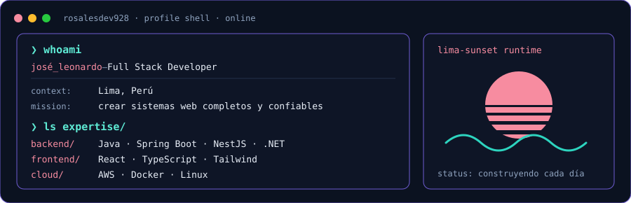

---

## `$ whoami`

  

## `$ cat tech-stack.yaml`

| `rosalesdev928:~$ cat tech-stack.yaml` | |
| --- | --- |
| `├─ ⚙ backend:`  `Java · Spring Boot · Node.js · NestJS · Express · PHP · C# · .NET` | `├─ ✦ frontend:`  `React · TypeScript · JavaScript · Vite · Tailwind · Bootstrap · HTML · CSS` |
| `├─ ☁ cloud_devops:`  `AWS · Docker · Linux · Git · GitHub · Postman` | `╰─ ▣ databases:`  `MySQL · SQL Server · PostgreSQL · Redis` |
| `status: ready  ·  environment: production` | |

---

## `$ ls projects/`

| Proyecto | Qué hace | Stack |
| --- | --- | --- |
| [**Radar**](https://github.com/rosalesdev928/radar) · [demo](https://radar-lovat-ten.vercel.app) | Mapa en vivo de emergencias de Lima con agentes de IA que contrastan reportes vecinales con el parte oficial | `Node.js` `Express` `React` `Leaflet` `API de Anthropic` |
| [**BotiClic**](https://github.com/rosalesdev928/boticlic) | E-commerce de farmacia con recetas y delivery, con 4 roles y control de acceso con JWT | `Java 21` `Spring Boot` `Spring Security` `MySQL` |
| [**ChecaBien**](https://github.com/Aqui-Estamos/checabien-backend) | Backend en producción de una plataforma ciudadana de información electoral (40k usuarios activos) | `NestJS` `TypeORM` `MySQL` `Redis` `AWS` |
| [**ey-fit-pack**](https://github.com/rosalesdev928/ey-fit-pack) | API REST de validaciones con Swagger y base de datos dinámica | `C#` `.NET` `Entity Framework Core` |

---

## `$ connect --socials`

Hecho con 💖 y mucho café desde Lima, Perú · @rosalesdev928

